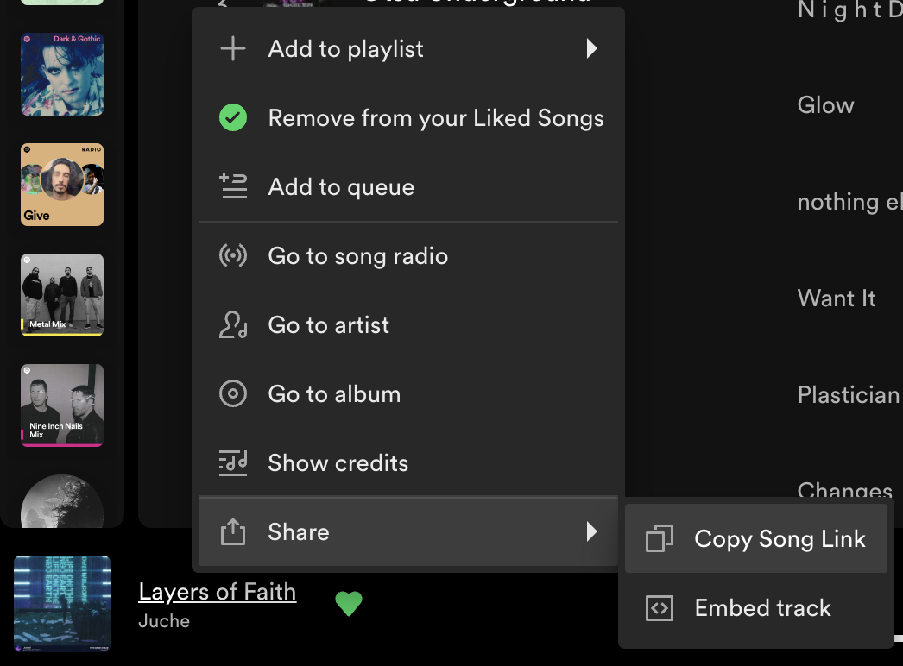
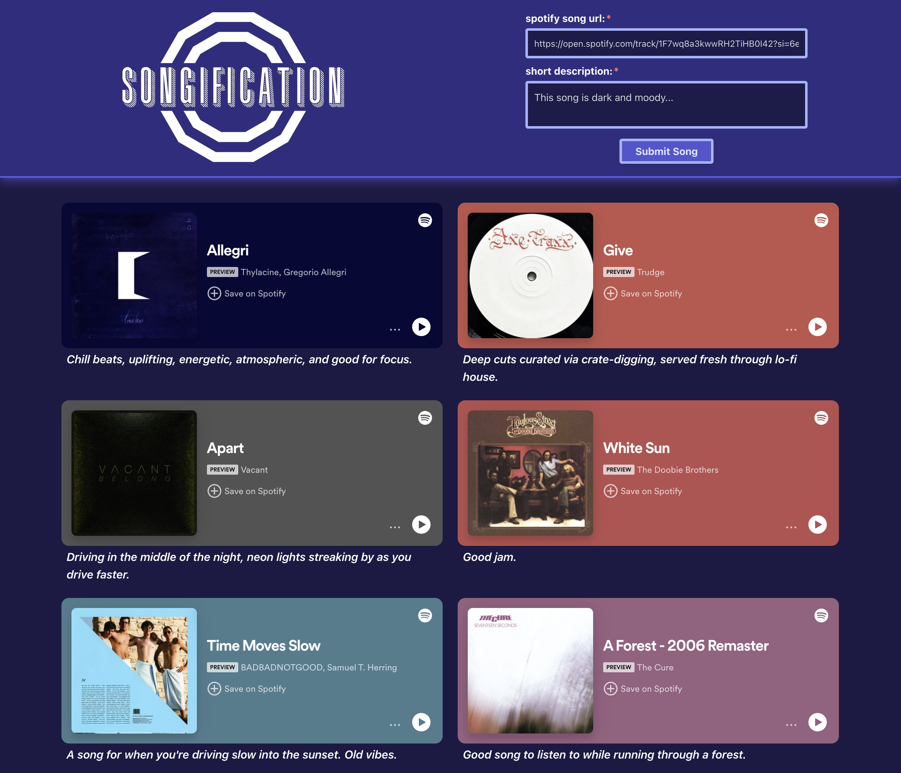

# SONGIFICATION

## Tech

- Front End: Typescript, React, Axios, Vite
- Back End: Javascript, Express, postgreSQL

## About

Songification is an anonymous song recommendation board that shows 12 random Spotify songs submitted by users. More song recommendations can be curated by simply refreshing the page. I did not create the widget; I am using the widget created by Spotify to power the listening experience on the site.

## Functionality

If you do not have a Spotify account, you can listen to the 30 second previews. However, if you do have a Spotify account, the widget allows you to play the full song after logging in via widget by several different methods provided by the widget itself. This can be triggered by clicking on **Save on Spotify** or clicking on the three dots (**...**) to open a menu to **Play on Spotify** or **Save on Spotify**. After logging in, you can control playback of music through the widget and on refresh of the page, the widget should recognize you have an account and provide full playback of the song if you have a current subscription.

## How To Get Spotify Song URL

**Right-click song** in Spotify -> **Share** -> **Copy Song Link**.

## Responsive Design

- High-DPI: Three columns of four songs.
- Between: Two columns of six songs.
- Mobile: One column of twelve songs.

## Preview

